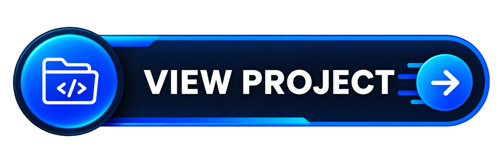

<h1 align="center">Hi Folks, I'm Deepak K</h1>

<h3 align="center">
Software Engineer • React.js Developer • ERPNext Developer • Data Science Enthusiast
</h3>

  

# About Me

Software Engineer with experience in **React.js**, **ERPNext**, **Frappe Framework**, **Python**, and **Data Science**.

- Software Engineer @ Innoblitz Technologies
- Pursuing MCA - University of Madras
- React.js & ERPNext Developer
- Data Science Enthusiast
- Learning AI, Machine Learning & Cloud

---

# Tech Stack

---

# Professional Experience

<table width="100%">
  <tr>
    <th align="left"><h3>Software Engineer</h3></th>
    <th align="left"><h3>Associate Software Engineer</h3></th>
  </tr>

  <tr>
    <td align="left">
      <strong>Innoblitz Technologies and Systems Pvt. Ltd.</strong> Chennai, Tamil Nadu, India · On-site
    </td>
    <td align="left">
      <strong>RK Techsoft India</strong> Chennai, Tamil Nadu, India · On-site
    </td>
  </tr>

  <tr>
    <td valign="top">
      Developed HRMS, CRM, and ERP products using Frappe Framework, ERPNext, and React.js, with a focus on customization, automation, and performance.  
      • React.js Development 
      • ERPNext Customization 
      • Frappe Framework 
      • REST API Integration 
      • Dashboard Development 
      • Report Development 
    </td>
    <td valign="top">
      Developed web applications using PHP, React.js, and MySQL, with experience in website development, system analysis, and client-focused solutions.  
      • PHP Development 
      • MySQL 
      • Website Development 
      • System Analysis 
      • Client Support
    </td>
  </tr>
</table>

---

# Education

## Master of Computer Applications

University of Madras

**Sep 2025 - May 2027**

Currently Pursuing

---

## B.Sc Computer Science with Data Science

St Thomas College of Arts and Science

CGPA **8.38**

---

# Featured Projects

<table width="100%">
<tr>

<td width="33%" valign="top">

<h3 align="center">GhostPay</h3>

  
  
  

Privacy-focused digital payment platform designed for secure, fast, and seamless transactions.

  

</td>

<td width="33%" valign="top">

<h3 align="center">Sign Language Interpreter</h3>

  
  
  

Real-time hand gesture recognition system that converts sign language into text with accurate detection and instant processing.

  

</td>

<td width="33%" valign="top">

<h3 align="center">ERPNext Customization</h3>

  
  
  

Custom CRM modules, reports, dashboards, and workflow automation for streamlined business operations.

  

</td>

</tr>
</table>

---

# Publications

Analysis of Cryptography on Blockchain and Encryption Technology

ICCIS 2023

ISBN: 978-93-94412-20-0

---

<h2 align="center">Connect with Me</h2>

